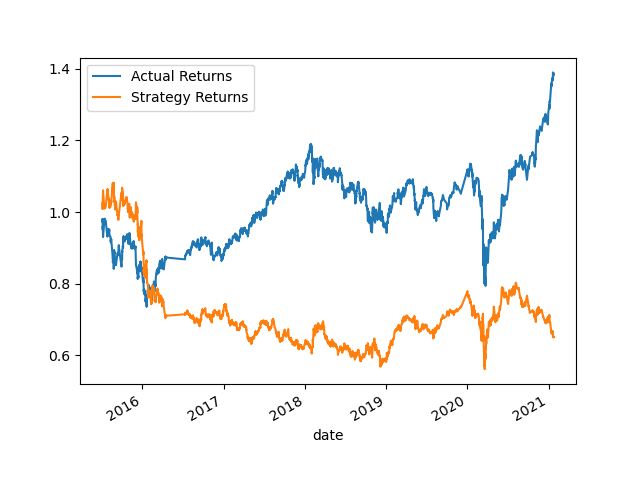
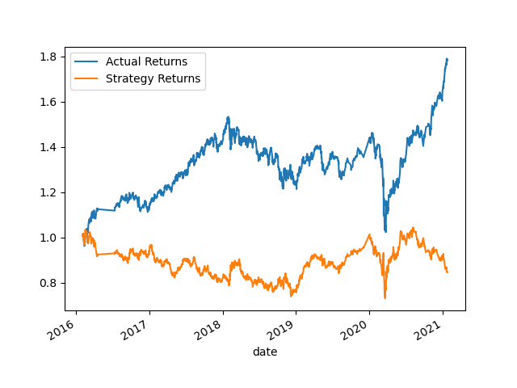
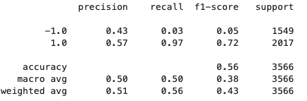
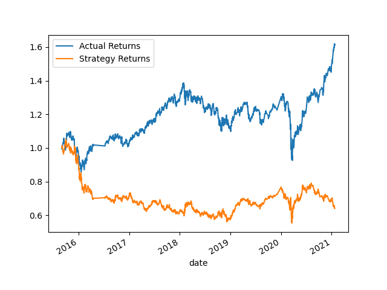
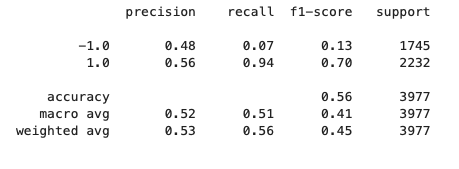
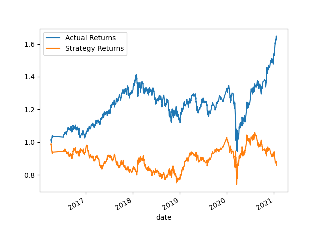
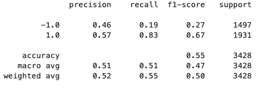
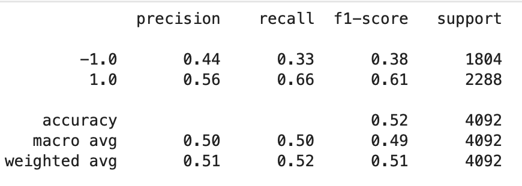

# Algorithmic Trading
## Results

Baseline Trading Algorithm: 
Ending period for the training data: 3 months offset 
Short-window for SMA values: 4 
Long-window for SMA values: 100 
Results cumulative return: Actual Returns: 1.386 and Strategy Returns: .652 

 
 

Tuned Algorithm: 
Adjusted model’s size of the training dataset. 
Ending period for the training data: 10 months offset 
Short-window for SMA values: 4 
Long-window for SMA values: 100 
Results cumulative return: Actual Returns: 1.786 and Strategy Returns: .8482 

 

 

Impact from increasing the training window: 
Increasing the training window almost did not impact the classification report but it did increase the strategy cumulative return.  

Tuned Algorithm: 
Adjusted the SMA input features. 
Ending period for the training data: 3 months offset 
Short-window for SMA values: 75 
Long-window for SMA values: 125 
Results cumulative return: Actual Returns: 1.786 and Strategy Returns:.652 

 

 

Impact from increasing the SMA windows: 
Increasing both SMA windows yield a slight better precision, recall and f-1 score for predicting -1 while still maintaining very similar scores for predicting 1 compared to the original algorithmic model and the strategy return. 

Tuned Algorithm: 
Adjusted the SMA input features. 
Ending period for the training data: 10 months offset 
Short-window for SMA values: 75 
Long-window for SMA values: 175 
Results cumulative return: Actual Returns: 1.386 and Strategy Returns:.65 

 

 

Trading Algorithm using Logistic Regression: 
Ending period for the training data: 3 months offset 
Short-window for SMA values: 4 
Long-window for SMA values: 100 
Results cumulative return: Actual Returns: 1.386 and Strategy Returns: .652 

 

 

### Conclusion
By looking at the classification reports and cumulative returns of the different algorithmic models we can see there is still room for improvement. Accuracy scores did not reach any greater than .56 and very low scores for the selling signal (-1). Addintionally, cumulative returns where much lower than actual returns. The best result was when training was 10 months SMA short window= 75 and long window =175.

It is important to note that the model when given a training window greater than 12 months was not able to predict any selling signal (-1) which leaves us room for improvement since the dataset provided contains 7 years of data. 

Using LogisticRegression instead of SVC did better at predicting -1 signal but still yield an accuracy score of .52 and less returns than the actual returns. 

Looking at the graphs we can see that there are moments where the model looks like the  actual returns and strategy returns are inversed which could be explained by the low ability of the model to predict selling signal.

